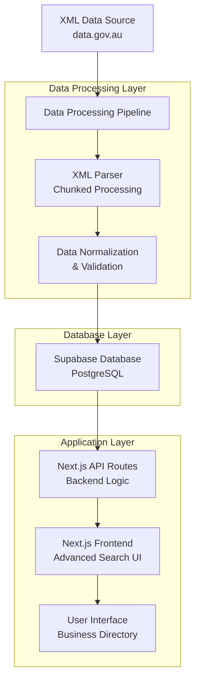

# Firmable Assessment - ABN Business Directory

A comprehensive full-stack application for processing, managing, and searching Australian Business Number (ABN) data. 
Built with Next.js, TypeScript, and Supabase, this application demonstrates enterprise-level data processing with advanced search capabilities 
and modern UI/UX design.

**Live Demo**: [View Application](https://firmable-assessment.vercel.app/)
**Data Source** [View Source](https://data.gov.au/data/dataset/abn-bulk-extract)

## 🏗️ System Architecture



## ⚡ Key Features

### 🔍 Advanced Search & Filtering
- **Multi-field Search**: Company name, ABN, trading name, address
- **Geographic Filtering**: State-based filtering with statistics
- **Business Status**: Active, cancelled, historical records

## 🎨 UI Components

### Design System
- **Color Palette**: Professional blue/gray theme
- **Typography**: Clean, readable font hierarchy
- **Spacing**: Consistent 8px grid system
- **Components**: Reusable, accessible UI elements

### Key Components
- **SearchBar**: Advanced search with filters
- **CompanyCard**: Business summary display
- **DataTable**: Sortable, filterable table
- **CompanyModal**: Detailed business information
- **FilterPanel**: Advanced filtering interface
- 

## 🛠️ Technology Stack

### Frontend
- **Next.js 15.5.2**: React framework with App Router
- **TypeScript**: Type-safe development
- **Tailwind CSS**: Utility-first styling
- **Shandcn UI**: Accessible component primitives
- **React Hook Form**: Performant form handling
- **Zod**: Schema validation
- **Lucide React**: Modern icon library

### Backend & Database
- **Next.js API Routes**: Serverless backend functions
- **Supabase**: PostgreSQL with real-time capabilities
- **TypeScript**: End-to-end type safety

### Data Processing
- **Node.js**: Server-side JavaScript runtime
- **xml2js**: XML parsing and transformation
- **Stream Processing**: Memory-efficient large file handling

## 📋 Prerequisites

- Node.js (v18 or higher)
- Bun (recommended) or npm/yarn
- Supabase account and project
- ABN XML data files from data.gov.au

## 🚀 Quick Start

### 1. Clone & Install
```bash
git clone https://github.com/Sharmil001/Firmable-Assessment.git
cd firmable-assessment
bun install
```

### 2. Environment Setup
```bash
cp .env.example .env.local
```

Configure your environment variables:
```env
NEXT_PUBLIC_SUPABASE_URL=your_supabase_project_url
NEXT_PUBLIC_SUPABASE_ANON_KEY=your_supabase_anon_key
SUPABASE_SERVICE_ROLE_KEY=your_service_role_key
DATABASE_URL=your_database_connection_string
```
### 3. Data Processing

Download ABN data and process it:
```bash
# Download XML data from data.gov.au
# Place files in scripts/data/ directory

# Run data processing
bun run scripts
```

### 4. Start Development Server
```bash
bun run dev
```

Visit `http://localhost:3000` to see the application.

## 🏗️ Project Structure

```
firmable-assessment/
├── app/                          # Next.js App Router
│   ├── api/                      # API routes
│   │   ├── companies/            # Company search endpoints
│   │   └── stats/                # Statistics endpoints
│   ├── components/               # React components
│   │   ├── ui/                   # Reusable UI components
│   │   ├── search/               # Search-specific components
│   │   └── business/             # Business detail components
│   │   └── common/               # Common components - Reusable UI components
│   │   └── layout/               # Layout details - Navbar, etc.
│   ├── lib/                      # Utility functions
│   │   ├── supabase.ts           # Database client
│   │   ├── validations.ts        # Zod schemas
│   │   └── utils.ts              # Helper functions
│   ├── hooks/                    # Custom hooks for business data fetching
│   ├── types/                    # TypeScript definitions
│   └── globals.css               # Global styles
├── scripts/                      # Data processing scripts
│   └── data-processor/           # XML processing pipeline
│       ├── index.ts              # Main processor
│       ├── xml-parser.ts         # XML parsing logic
│       └── supabase-uploader.ts  # Database upload logic
└── public/                       # Static assets
└── .env                          # Environment variables
```

## 🔧 Core Features Implementation

### Advanced Search Architecture

The search system implements multiple search strategies:

```sql
// Multi-field indexing for fast search
CREATE UNIQUE INDEX companies_abn_key ON public.companies USING btree (abn)
CREATE UNIQUE INDEX companies_pkey ON public.companies USING btree (id)
CREATE INDEX idx_abn ON public.companies USING btree (abn)
CREATE INDEX idx_companies_entity_name ON public.companies USING btree (entity_name text_pattern_ops)
CREATE INDEX idx_companies_entity_name_sort ON public.companies USING btree (entity_name)
CREATE INDEX idx_abn_sort ON public.companies USING btree (abn)
CREATE INDEX idx_registration_date_sort ON public.companies USING btree (registration_date)
CREATE INDEX idx_companies_address_state ON public.companies USING btree (((address ->> 'state'::text)))
CREATE INDEX idx_entity_type ON public.companies USING btree (entity_type)
CREATE INDEX idx_entity_name ON public.companies USING btree (entity_name)
CREATE INDEX idx_entity_name_tsv ON public.companies USING gin (to_tsvector('english'::regconfig, entity_name))
CREATE INDEX idx_abn_tsv ON public.companies USING gin (to_tsvector('english'::regconfig, abn))
```

### Pagination Strategy

Efficient cursor-based pagination for large datasets:

```typescript
const getPaginatedCompanies = async (cursor?: string, limit = 20) => {
	let query = supabase
		.from("companies")
		.select(
			"id, abn, abn_status, entity_name, entity_type, trading_name, gst_status, address, business_names, registration_date",
			{
				count: "estimated",
			},
		)
		.order(sortBy, { ascending: sortOrder === "asc" })
		.limit(perPage);

	const from = (page - 1) * perPage;
	const to = from + perPage - 1;
	query = query.range(from, to);

	const { data, count, error } = await query;
  
    return query;
};
```

## 🎯 API Endpoints

### Companies API

```typescript
// GET /api/companies
// Search and filter companies
interface SearchParams {
  q?: string;           // Search query
  state?: string;       // State filter
  status?: string;      // Business status
  page?: number;        // Page number
  limit?: number;       // Results per page
}

// GET /api/companies/stats
// Get aggregated statistics

// GET /api/companies/total
// Get total number of companies
```

### Usage Examples

```javascript
const response = await fetch('/api/companies?q=technology&state=NSW&page=1');
const { companies, total, page } = await response.json();
```

## 🚀 Deployment

### Production Build
```bash
bun run build
bun run start
```

### Environment Configuration
```env
# Production environment variables
NODE_ENV=production
NEXT_PUBLIC_SUPABASE_URL=production_url
NEXT_PUBLIC_SUPABASE_ANON_KEY=production_key
```
---
